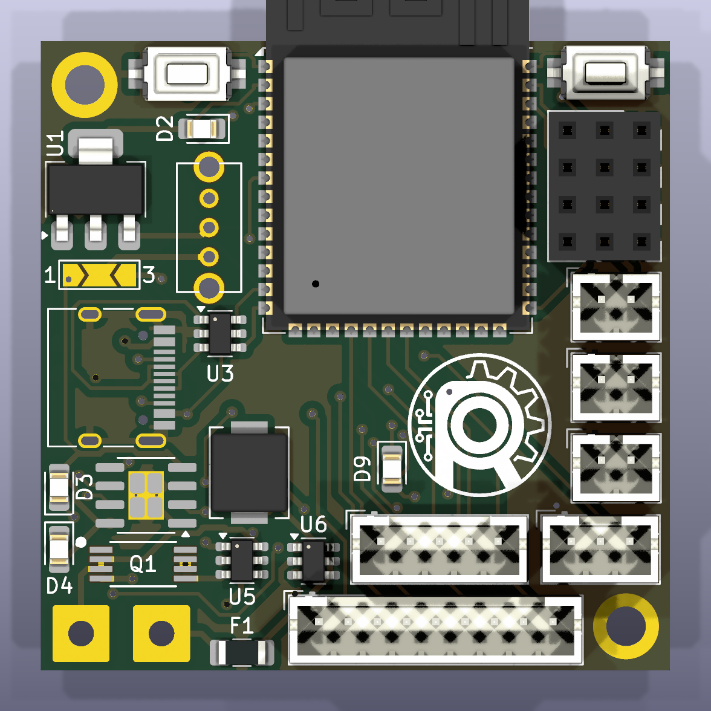
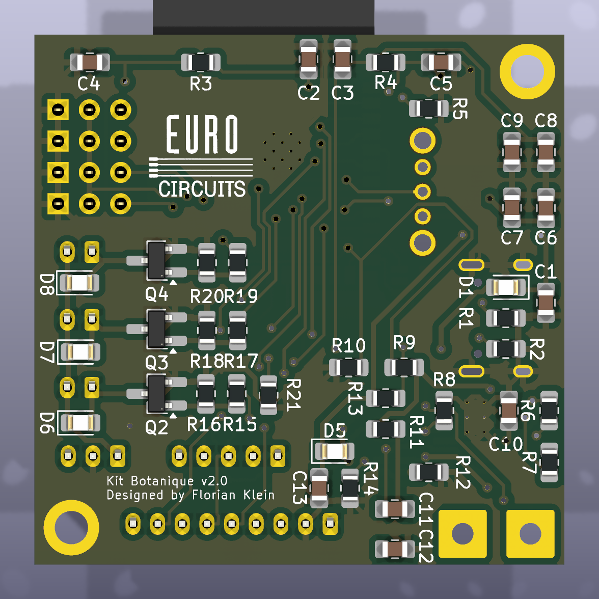

# Kit Botanique V2

  
  

The Kit Botanique is an automatic plant watering kit designed by [Robopoly](https://www.epfl.ch/campus/associations/robopoly/), the student makerspace of EPFL. It measures soil moisture and switches small pumps on when the plants need water.

Robopoly members buy the kit as separate parts and solder it themselves at the workshop, with help from the committee. It is an advanced kit: it uses small surface-mount components, so soldering experience is recommended but not required.

## Features

- ESP32-S3 module (WiFi and Bluetooth), programmed over USB-C with the Arduino IDE
- 3 pump outputs and 4 sensor inputs (soil moisture or water level)
- Powered over USB-C, or by a Li-ion battery with the optional battery extension
- Connectors for an LED strip and a touchscreen
- 43 × 43 mm board

The basic kit contains the board, one peristaltic pump and one soil moisture sensor.

## Repository contents

| Folder | Content |
|---|---|
| [`docs/`](docs) | [Assembly guide](docs/assembly_guide_v2.pdf), [schematic](docs/schema_v2.pdf), images |
| [`firmware/tests/`](firmware/tests) | Test programs used during assembly |
| [`hardware/kicad/`](hardware/kicad) | KiCad 10 project (schematic, PCB, libraries) |
| [`hardware/fabrication/`](hardware/fabrication) | Gerber files and bill of materials |
| [`hardware/3d/`](hardware/3d) | 3D model of the assembled board (STEP) |
| [`archive/v1/`](archive/v1) | Code of the first version of the kit |

## Building the kit

Follow the [assembly guide](docs/assembly_guide_v2.pdf) (in French for now). It goes step by step, with a test after each stage. Do not move on until the test passes.

| Stage | Guide sections | Test |
|---|---|---|
| 1. Power supply and ESP32 module | 1 to 9 | The blue LED lights up |
| 2. Buttons and white LED | 10 and 11 | `01_blink` makes the white LED blink |
| 3. Pumps and sensors | 12 to 14 | `02_pump_sensor_test` reads the sensors and runs the pumps |
| 4. Battery extension (optional) | 15 to 18 | |
| 5. Screen and LED strip connectors (optional) | 19 | |

Two things to know before you start:

- **Both sides of the board are used.** All resistors, capacitors, the Schottky diodes and the pump transistors go on the **bottom** side. The chips, LEDs, buttons and connectors go on the **top** side. Check the pictures above.
- **The 3-pad solder jumper (marked 1 and 3) selects the power source.** Bridge pads 1 and 2 for USB power (basic kit). Bridge pads 2 and 3 for battery power (battery extension). Never bridge all three pads.

## Programming

1. Install the [Arduino IDE](https://www.arduino.cc/en/software), then the **esp32 by Espressif Systems** package from the Boards Manager.
2. In the **Tools** menu, use these settings:

   | Setting | Value |
   |---|---|
   | Board | ESP32S3 Dev Module |
   | USB CDC On Boot | **Enabled** (otherwise the Serial Monitor stays empty) |
   | USB Mode | Hardware CDC and JTAG |
   | Upload Mode | USB-OTG CDC (TinyUSB) |
   | Flash Size | 4MB (32Mb) |
   | Partition Scheme | Default 4MB with spiffs |
   | PSRAM | Disabled |

3. Put the board in download mode: hold **BOOT** (top right button), press and release **RESET** (top left button), then release BOOT.
4. Upload the sketch. Then switch the board off and on again to start it.

The test programs in [`firmware/tests/`](firmware/tests):

| Sketch | What it does |
|---|---|
| [`01_blink`](firmware/tests/01_blink/01_blink.ino) | Blinks the white LED once per second |
| [`02_pump_sensor_test`](firmware/tests/02_pump_sensor_test/02_pump_sensor_test.ino) | Prints the 4 sensor values on the Serial Monitor (115200 baud), then runs the 3 pumps for 3 seconds |

> **Careful:** the white LED and pump 1 use the same pin. `01_blink` also runs pump 1 if one is plugged in.

The watering program itself is not written yet.

## Pinout

| GPIO | Function |
|---|---|
| 1, 2, 3, 4 | Sensor inputs C1 to C4 |
| 17, 18, 21 | Pumps 1 to 3 (pump 1 shares GPIO 17 with the white LED) |
| 15 | LED strip data |
| 14 | Battery voltage divided by 2 |
| 5, 6, 7, 10 | Screen: RST, DC, backlight, CS |
| 8, 16 | Touchscreen: CS, IRQ |
| 11, 12, 13 | SPI shared by screen and touchscreen: MOSI, SCLK, MISO |
| 0 | BOOT button |

Sensors are powered with 5 V, but their signal goes straight to the ESP32 and must stay below 3.3 V.

The full wiring is in the [schematic](docs/schema_v2.pdf).

## Hardware files

The KiCad project is in [`hardware/kicad/`](hardware/kicad). Open `kit_botanique_v2.kicad_pro` with KiCad 10 or later. The board is manufactured by Eurocircuits from [`gerber_v2.zip`](hardware/fabrication/gerber_v2.zip), the files that were sent for the current boards.

## First version

The first Kit Botanique used an ESP32 development board with 6 pumps and 6 sensors. Its code is kept in [`archive/v1/`](archive/v1/Sensors_Pumps_Test/Sensors_Pumps_Test.ino).

## Links

- [Kit Botanique V2 page](https://www.epfl.ch/campus/associations/robopoly/kits/kit-botanique-v2/)
- [Robopoly](https://www.epfl.ch/campus/associations/robopoly/), workshop BM 9139, EPFL
- Contact: [robopoly@epfl.ch](mailto:robopoly@epfl.ch)

## License

This project is published by Robopoly under the [Creative Commons Attribution-NonCommercial-ShareAlike 4.0](LICENSE.txt) license.
